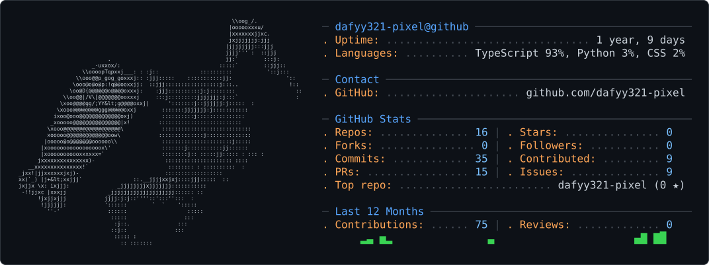

### Hello, world 👋 · 你好，世界

I build practical AI agents, reliable LLM systems, and open-source tools.

人工智能专业学生，关注 AI Agent、LLM Systems 与开源工程。

## About me

- 🎓 Artificial Intelligence major
- 🔭 Currently an AI intern at **[COMPANY / TEAM]**
- 🧪 Three AI internships, including one at **Peking University Shenzhen Graduate School**
- 🤖 Exploring **[CURRENT AGENT / LLM SYSTEMS FOCUS]**
- 🌱 Learning in public through open source
- 📫 Reach me at **[EMAIL / BLOG / SOCIAL LINK]**

> [中文一句话介绍或个人理念]

## System snapshot

<picture>
  <source media="(prefers-color-scheme: dark)" srcset="./assets/ascii-dark.svg">
  <source media="(prefers-color-scheme: light)" srcset="./assets/ascii-light.svg">
  
</picture>

## Selected builds

| Project | What it does | Stack |
|---|---|---|
| [open-source-contributor](https://github.com/dafyy321-pixel/open-source-contributor) | A Codex skill for finding, validating, and delivering meaningful open-source contributions. | Python · Agent workflow |
| [decision-dish](https://github.com/dafyy321-pixel/decision-dish) | **[Add one sentence explaining the user problem and your contribution.]** | TypeScript · **[STACK]** |
| [SnapCal](https://github.com/dafyy321-pixel/SnapCal) | **[Add one sentence explaining the user problem and your contribution.]** | TypeScript · **[STACK]** |

## Open-source quest log

<!-- OSS_CONTRIBUTIONS:START -->
_The first workflow run will replace this line with your merged contributions._
<!-- OSS_CONTRIBUTIONS:END -->

<picture>
  <source media="(prefers-color-scheme: dark)" srcset="./assets/pacman-dark.svg">
  <source media="(prefers-color-scheme: light)" srcset="./assets/pacman-light.svg">
  
</picture>

## Experience

| Period | Organization | Role and impact |
|---|---|---|
| **[NOW]** | **[CURRENT COMPANY / TEAM]** | AI Intern · **[PROJECT / MEASURABLE IMPACT]** |
| **[DATES]** | Peking University Shenzhen Graduate School | AI Intern · **[RESEARCH OR ENGINEERING OUTCOME]** |
| **[DATES]** | **[COMPANY / LAB]** | AI Intern · **[PROJECT / OUTCOME]** |

### Let’s build useful AI systems.

[Email](mailto:YOUR_EMAIL) · [Blog](YOUR_BLOG_URL) · [LinkedIn](YOUR_LINKEDIN_URL) · [Résumé](YOUR_RESUME_URL)

