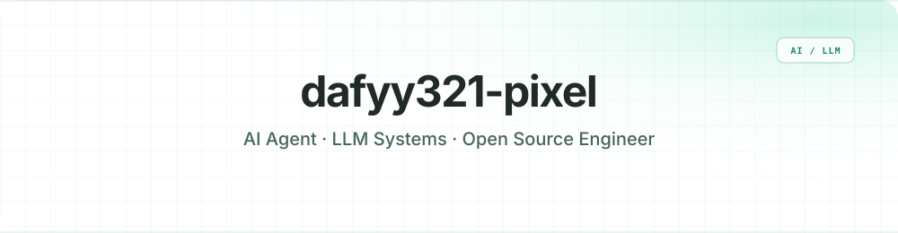
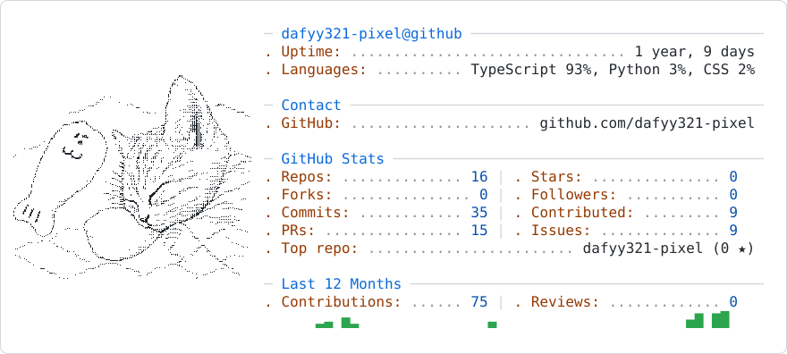
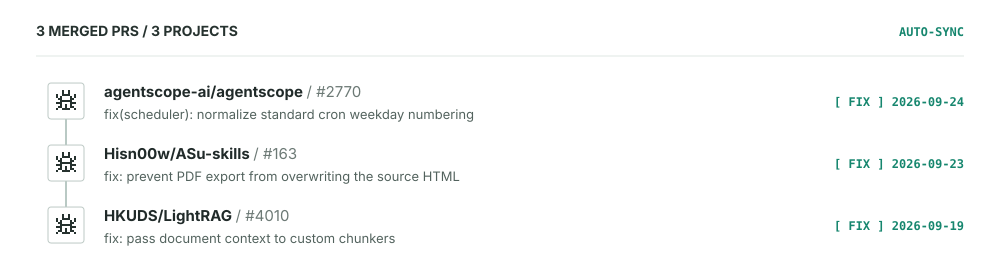

  <strong>English</strong> · <a href="./README.zh-CN.md">简体中文</a>

  

  

  
  
  
  

## About me

- 🎓 Artificial Intelligence major focused on **AI agents, LLM systems, and open-source engineering**
- 🧪 Hands-on AI engineering across **three internships**, spanning academic research and industry delivery
- 🔭 Currently working as an AI intern 
- 🌱 Contributing to open source and learning in public
- 📫 Reach me at **[EMAIL]**

<!-- Official seal source: Peking University Visual Identity Management Office — https://vim.pku.edu.cn/xzzq/index.htm -->

  
  <strong>Research · Peking University Shenzhen Graduate School</strong> 
  Worked on <strong>Ai Agent</strong>, connecting research ideas with working AI systems.

 

## System snapshot

<picture>
  <source media="(prefers-color-scheme: dark)" srcset="./assets/ascii-dark.svg">
  <source media="(prefers-color-scheme: light)" srcset="./assets/ascii-light.svg">
  
</picture>

## Selected builds

| Project | What it does | Stack |
|---|---|---|
| [open-source-contributor](https://github.com/dafyy321-pixel/open-source-contributor) | A Codex skill for finding, validating, and delivering meaningful open-source contributions. | Python · Agent workflow |
| [decision-dish](https://github.com/dafyy321-pixel/decision-dish) | **[Add one sentence explaining the user problem and your contribution.]** | TypeScript · **[STACK]** |
| [SnapCal](https://github.com/dafyy321-pixel/SnapCal) | **[Add one sentence explaining the user problem and your contribution.]** | TypeScript · **[STACK]** |

## Open-source quest log

<!-- OSS_CONTRIBUTIONS:START -->

  

[View all merged pull requests →](https://github.com/pulls?q=is%3Apr%20author%3Adafyy321-pixel%20is%3Amerged)
<!-- OSS_CONTRIBUTIONS:END -->

<picture>
  <source media="(prefers-color-scheme: dark)" srcset="./assets/pacman-dark.svg">
  <source media="(prefers-color-scheme: light)" srcset="./assets/pacman-light.svg">
  
</picture>

  <strong>Let’s build useful AI systems.</strong>  
  <a href="mailto:YOUR_EMAIL">Email</a> ·
  <a href="YOUR_BLOG_URL">Blog</a> ·
  <a href="YOUR_LINKEDIN_URL">LinkedIn</a> ·
  <a href="YOUR_RESUME_URL">Résumé</a>

